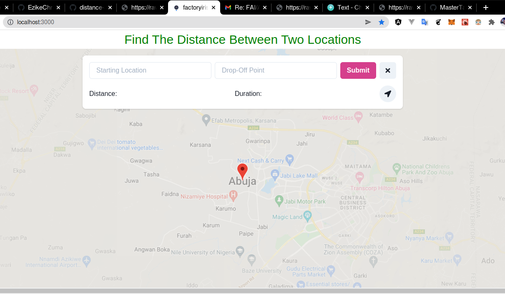

# Waypoint Router

Waypoint Router is a simple application that shows the route for the places you want to go to. You set your starting point and drop-off point.
It Then uses Google's Maps API with React.js to waypoint that location.



### Stack

ReactJS
ChakraUI
React-google-maps
GoogleMapsApi

## Project setup

```
yarn
```

### Compile and hot-reloads for development

```
yarn start
```

### Creating a Production Build

```
yarn build
```

### Google Map API key

Create an API in the google developers console [https://console.developers.google.com](https://console.developers.google.com)

Add a `.env` file or `.env.local` in the project root and specify your API key as `REACT_APP_GOOGLE_MAPS_API_KEY= Place Your Api Key Here`

## Resources

* [React](https://reactjs.org/)
* [Chakra](https://chakra-ui.com/)
* [GoogleMaps](https://console.cloud.google.com/)
